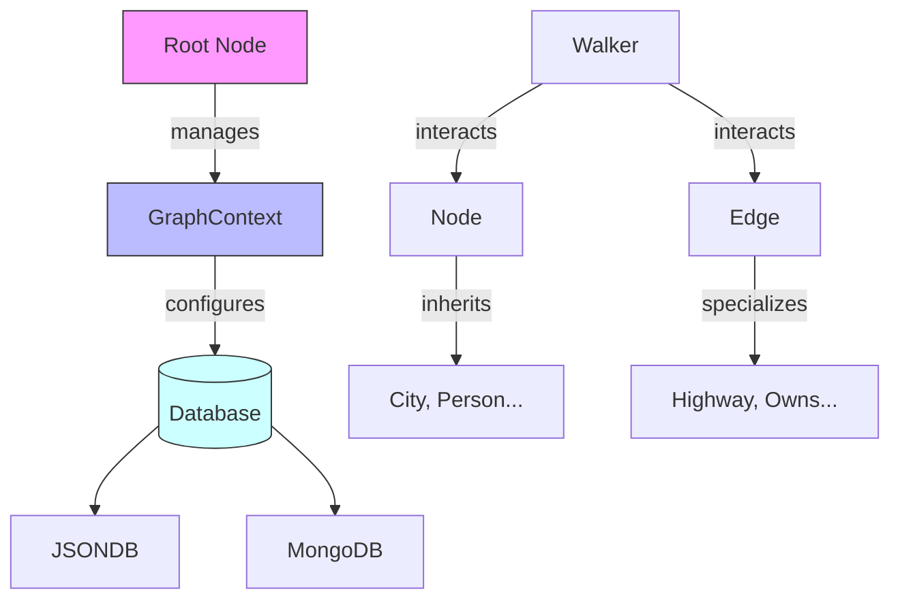

# jvspatial: Asynchronous Object-Spatial Python Library


## Overview

**jvspatial** is an asynchronous, object-spatial Python library designed for building robust persistence and business logic application layers. Inspired by Jaseci's object-spatial paradigm and leveraging Python's async capabilities, jvspatial empowers developers to model complex relationships, traverse object graphs, and implement agent-based architectures that scale with modern cloud-native concurrency requirements. Key capabilities:

- **GraphContext Architecture**: Clean dependency injection for database management
- **Object Pagination**: Efficient database-level pagination for large graphs and datasets
- Typed node/edge modeling via Pydantic
- Precise control over graph traversal
- Multi-backend persistence (JSON/MongoDB)
- Integrated REST API endpoints
- Async/await architecture


## Installation

## Version Compatibility
**Supported Environments**:
- Python 3.9+
- MongoDB 5.0+ (optional)
- FastAPI 0.88+ (for REST features)

⚠️ **Breaking Changes in v0.1.0**:
- Mandatory `_version` field in all documents
- Required `db_type` parameter for GraphContext
- Simplified Walker response structure


```bash
# Basic installation
pip install jvspatial

# Development setup
git clone https://github.com/TrueSelph/jvspatial
cd jvspatial
pip install -e .[dev]
```

## Quick Start

### Simple Usage (Automatic GraphContext)
```python
import asyncio
from jvspatial.core import Node, Walker, Root, on_visit, on_exit

class MyAgent(Node):
    """Agent with spatial properties"""
    published: bool = True
    latitude: float = 0.0
    longitude: float = 0.0

class AgentWalker(Walker):
    @on_visit(Root)
    async def on_root(self, here):
        # Create and connect an agent
        agent = await MyAgent.create(latitude=40.7128, longitude=-74.0060)
        await here.connect(agent)
        await self.visit(agent)

    @on_visit(MyAgent)
    async def on_agent(self, here):
        print(f"Visiting agent at {here.latitude}, {here.longitude}")

    @on_exit
    async def respond(self):
        self.response["status"] = "completed"

async def main():
    root = await Root.get()
    walker = AgentWalker()
    result = await walker.spawn(root)
    print(f"Result: {result.response}")

if __name__ == "__main__":
    asyncio.run(main())
```

### Advanced Usage (Explicit GraphContext)
```python
import asyncio
from jvspatial.core import Node, Walker, on_visit, GraphContext
from jvspatial.db.factory import get_database

class City(Node):
    name: str
    population: int = 0

class CityWalker(Walker):
    @on_visit(City)
    async def visit_city(self, here):
        print(f"Visiting {here.name} (pop: {here.population:,})")

async def main():
    # Create GraphContext with specific database
    ctx = GraphContext(database=get_database(db_type="json", base_path="my_data"))

    # Create entities through context
    chicago = await ctx.create_node(City, name="Chicago", population=2700000)

    # Walker traversal works the same
    walker = CityWalker()
    await walker.spawn(start=chicago)

if __name__ == "__main__":
    asyncio.run(main())
```

## Table of Contents
- [Optimization Insights](#optimization-insights)

- [Introduction](#introduction)
- [Installation](#installation)
- [Core Concepts](#core-concepts)
- [Getting Started](#getting-started)
- [Object Pagination](#object-pagination)
- [Enhanced @on_visit Decorator](#enhanced-on_visit-decorator)
- [GraphContext & Database Management](docs/md/graph-context.md)
- [Examples](docs/md/examples.md)
- [Entity Reference](docs/md/entity-reference.md)
- [Object Pagination Guide](docs/md/pagination.md)
- [Walker Queue Operations](docs/md/walker-queue-operations.md)
- [Walker Skip Operation](docs/md/walker-skip.md)
- [Database Configuration](docs/md/database-config.md)
- [REST API Integration](docs/md/rest-api.md)
- [Advanced Features](docs/md/advanced-usage.md)
- [Project Structure](#project-structure)
- [Troubleshooting](docs/md/troubleshooting.md)
- [Contributing](docs/md/contributing.md)

## Introduction

**jvspatial** is an asynchronous, object-spatial Python library designed for building robust persistence and business logic layers. Inspired by Jaseci's object-spatial paradigm and leveraging Python's async capabilities, jvspatial empowers developers to model complex relationships, traverse object graphs, and implement agent-based architectures that scale with modern cloud-native concurrency requirements.

### Key Features

- **GraphContext Architecture**: Clean dependency injection for database management - no scattered database connections
- **Object Pagination**: Efficient database-level pagination for large graphs and datasets with filtering and ordering
- **Async-First Design**: Built with native async/await support throughout
- **Enhanced @on_visit Decorator**: Multi-target hooks, catch-all patterns, and edge traversal
- **Type-Driven Entities**: Pydantic models for node/edge definitions
- **Flexible Persistence**: Multiple database backends (JSON, MongoDB)
- **Imperative Walkers**: Explicit traversal control with visit/exit hooks
- **Edge Processing**: First-class support for processing connections during traversal
- **Smart Entity Responses**: Nodes and edges can respond differently to specific walker types
- **REST Endpoint Mixins**: Combine walkers with FastAPI routes
- **Explicit Connections via Edges**: Manual relationship management between nodes
- **Object Lifecycle**: Manual save/load operations for granular control
- **Testing-Friendly**: Database isolation and dependency injection for robust testing

## Installation

### Basic Installation
```bash
pip install jvspatial
```

### Development Installation
```bash
git clone https://github.com/TrueSelph/jvspatial
cd jvspatial
pip install -e .[dev]
```

### Testing Installation
```bash
# Install with test dependencies (includes httpx for FastAPI TestClient)
pip install -e .[test]

# Or install from requirements file
pip install -r requirements-test.txt
```

### Dependencies
```bash
# Core dependencies
pip install pydantic>=2.0

# For REST API examples:
pip install fastapi uvicorn

# For testing (required for FastAPI TestClient):
pip install httpx

# Optional MongoDB support:
pip install motor pymongo
```

## Core Concepts



### Nodes
Nodes represent entities in your object-spatial graph. They can store any data and have operations which may be triggered by visiting Walkers.

```python
from jvspatial.core import Node

class City(Node):
    name: str
    population: int
    latitude: float
    longitude: float

# Create a city
chicago = await City.create(
    name="Chicago",
    population=2697000,
    latitude=41.8781,
    longitude=-87.6298
)
```

### Edges
Edges represent relationships between nodes with optional properties.

```python
from jvspatial.core import Edge

class Highway(Edge):
    lanes: int = 4
    speed_limit: int = 65

# Connect cities with a highway
highway = await chicago.connect(detroit, edge=Highway, lanes=6, speed_limit=70)
```

### Walkers
Walkers traverse the object-spatial graph and execute logic at each node they visit.

```python
from jvspatial.core import Walker, on_visit, on_exit

class Tourist(Walker):
    @on_visit(City)  # Single target
    async def visit_city(self, here):
        print(f"Visiting {here.name}")

        # Find connected cities and visit them
        connected_cities = await (await here.nodes()).filter(node='City')
        await self.visit(connected_cities)

    @on_visit(Highway, Railroad)  # Multi-target - handles BOTH types
    async def use_transport(self, here):
        print(f"Traveling via {here.__class__.__name__}: {here.name}")

    @on_visit()  # Catch-all - triggered by ANY node/edge type
    async def log_visit(self, here):
        self.response.setdefault("visited", []).append(here.__class__.__name__)

    @on_exit
    async def trip_complete(self):
        self.response["message"] = "Trip completed!"
```

### Root Node
The singleton Root serves as the entry point for all graph operations.

```python
from jvspatial.core import Root

# Get the root node (creates it if it doesn't exist)
root = await Root.get()
```

## Getting Started

### 1. Basic Node Creation and Connection

```python
import asyncio
from jvspatial.core.entities import Node, Root

class Person(Node):
    name: str
    age: int

async def basic_example():
    # Get root node
    root = await Root.get()

    # Create nodes
    alice = await Person.create(name="Alice", age=30)
    bob = await Person.create(name="Bob", age=25)

    # Connect nodes
    await root.connect(alice)
    await root.connect(bob)
    await alice.connect(bob)

    # Query connections
    alice_connections = await alice.nodes()
    print(f"Alice is connected to: {[node.name for node in alice_connections]}")

asyncio.run(basic_example())
```

## Object Pagination

Handle large graphs and datasets efficiently with built-in pagination support:

### Simple Pagination

```python
from jvspatial.core import paginate_objects, City

# Get first page of cities (default: 20 per page)
cities = await paginate_objects(City)

# Get specific page with custom size
cities_page_2 = await paginate_objects(City, page=2, page_size=50)

# Paginate with filters
large_cities = await paginate_objects(
    City,
    filters={"population": {"$gt": 1000000}}
)
```

### Advanced Pagination

```python
from jvspatial.core import ObjectPager, paginate_by_field

# Create a pager for complex operations
pager = ObjectPager(
    City,
    page_size=100,
    filters={"population": {"$gt": 500000}},
    order_by="population",
    order_direction="desc"
)

# Get pages
large_cities = await pager.get_page(1)
more_cities = await pager.next_page()

# Field-based pagination
top_cities = await paginate_by_field(
    City,
    field="population",
    order="desc",
    page_size=25
)
```

### Processing Large Datasets

```python
import asyncio
from jvspatial.core import ObjectPager, Customer

async def process_all_customers():
    """Process large customer base efficiently."""
    pager = ObjectPager(Customer, page_size=100)

    while True:
        customers = await pager.next_page()
        if not customers:
            break

        # Process batch in parallel
        tasks = [analyze_customer(customer) for customer in customers]
        await asyncio.gather(*tasks)

        print(f"Processed page {pager.current_page}")

async def analyze_customer(customer):
    """Analyze individual customer."""
    # Perform customer analysis
    neighbors = await customer.neighbors(limit=5)
    # ... analysis logic
```

### 2. Walker Traversal

```python
import asyncio
from jvspatial.core.entities import Node, Walker, Root, on_visit

class Person(Node):
    name: str
    visited: bool = False

class NetworkExplorer(Walker):
    @on_visit(Person)
    async def visit_person(self, here):
        here.visited = True
        await here.save()
        print(f"Visited {here.name}")

        # Visit unvisited neighbors
        neighbors = await (await here.nodes()).filter(node='Person')
        unvisited = [n for n in neighbors if not n.visited]
        await self.visit(unvisited)

async def traversal_example():
    root = await Root.get()

    # Create a network
    alice = await Person.create(name="Alice")
    bob = await Person.create(name="Bob")
    charlie = await Person.create(name="Charlie")

    await root.connect(alice)
    await alice.connect(bob)
    await bob.connect(charlie)

    # Traverse the network
    explorer = NetworkExplorer()
    await explorer.spawn(alice)

asyncio.run(traversal_example())
```

## Complex Traversal Example
````markdown
```python
# From traversal_demo.py (simplified)
class DeliveryWalker(Walker):
    @on_visit(City)
    async def deliver_package(self, here: City):
        # Highlight 1: Conditional delivery logic
        if here.is_hub and random.random() < 0.75:
            self.packages_delivered += 1

        # Highlight 2: Probabilistic path selection
        connections = await here.edges(edge_type=Highway)
        if connections:
            next_city = random.choice([c.target_node for c in connections])
            await self.visit(next_city)

    @on_exit
    async def final_report(self):
        # Highlight 3: Built-in metrics collection
        self.response = {
            "delivered": self.packages_delivered,
            "visited": len(self.visited_nodes)
        }
```
Key Features Demonstrated:
- Conditional node processing
- Edge-based traversal decisions
- Automatic metric collection
- Context-managed database sessions
````

## Enhanced @on_visit Decorator

**NEW**: The `@on_visit` decorator now supports powerful multi-target and edge traversal capabilities:

### Multi-Target Hooks
Handle multiple entity types with a single hook function:

```python
class LogisticsWalker(Walker):
    @on_visit(Warehouse, Port, Factory)  # Triggers for ANY of these types
    async def handle_facility(self, here):
        facility_type = here.__class__.__name__
        print(f"Processing {facility_type}: {here.name}")

        # Business logic that applies to all facility types
        await self.process_inventory(here)
```

### Catch-All Hooks
Create universal hooks that respond to any entity type:

```python
class InspectionWalker(Walker):
    @on_visit()  # No parameters = catch-all
    async def inspect_anything(self, here):
        # This runs for EVERY node and edge visited
        self.response.setdefault("inspected", []).append({
            "type": here.__class__.__name__,
            "id": here.id
        })
```

### Transparent Edge Traversal
Walkers now automatically traverse edges when moving between connected nodes:

```python
class TransportWalker(Walker):
    @on_visit(City)
    async def visit_city(self, here):
        print(f"Arrived in {here.name}")

        # Find connected cities and queue them for visits
        connected_cities = await (await here.nodes()).filter(node='City')
        await self.visit(connected_cities)  # Edges will be traversed automatically!

    @on_visit(Highway, Railroad)  # Handle different transport types
    async def use_transport(self, here):
        # This hook is triggered automatically during traversal between cities
        transport_cost = self.calculate_cost(here)
        print(f"Using {here.name}, cost: ${transport_cost}")
        # Walker automatically moves to the connected city after processing
```

### Smart Entity Responses
Nodes and Edges can respond differently to specific Walker types:

```python
# Smart node that responds to different walker types
class SmartWarehouse(Warehouse):
    @on_visit(LogisticsWalker, InspectionWalker)  # Multi-target response
    async def handle_authorized_access(self, visitor):
        if isinstance(visitor, LogisticsWalker):
            visitor.response["inventory_access"] = "GRANTED"
        elif isinstance(visitor, InspectionWalker):
            visitor.response["compliance_report"] = self.get_compliance_data()

# Smart edge with walker-specific behavior
class SmartHighway(Highway):
    @on_visit(LogisticsWalker)
    async def commercial_vehicle_access(self, visitor):
        # Give commercial vehicles priority lane access
        visitor.response["priority_lane"] = True
        visitor.response["toll_discount"] = 0.15
```

### Type Validation
The decorator enforces proper targeting:
- **Walkers** can only target `Node` and `Edge` types
- **Nodes** and **Edges** can only target `Walker` types
- Invalid targeting raises `TypeError` at class definition time

```python
# ✅ Valid - Walker targeting Node types
class MyWalker(Walker):
    @on_visit(City, Warehouse)  # Valid
    async def handle_locations(self, here): pass

# ❌ Invalid - Walker cannot target other Walkers
class BadWalker(Walker):
    @on_visit(LogisticsWalker)  # TypeError!
    async def invalid_hook(self, here): pass
```

## Advanced Features

### Complex Node Filtering

```python
# Get nodes connected via specific edge types with properties
connected = await (await node.nodes(direction="out")).filter(
    node=['City', 'Town'],
    edge=[Highway, Railroad],
    speed_limit=65  # Filter by edge property
)
```

### Walker Execution Flow

```python
class InventoryWalker(Walker):
    def __init__(self):
        self.found_items = []

    @on_visit(Root)
    async def start_inventory(self, here):
        print("Starting inventory check")
        # Find all storage rooms connected to root
        storage_rooms = await (await here.nodes()).filter(node="StorageRoom")
        if storage_rooms:
            await self.visit(storage_rooms[0])
        else:
            print("No storage rooms found")
            self.response["error"] = "No storage facilities available"

    @on_visit("StorageRoom")
    async def check_storage(self, here):
        print(f"Checking storage room: {here.id}")
        # Find all inventory items in this storage
        items = await (await here.nodes()).filter(node="InventoryItem")
        self.found_items.extend(items)

        # Visit each item to scan details
        await self.visit(items)

    @on_visit("InventoryItem")
    async def record_item(self, here):
        print(f"Scanning item: {here.name} ({here.serial_number})")
        self.response.setdefault("items", []).append({
            "id": here.id,
            "name": here.name,
            "location": here.storage_location
        })

    @on_exit
    async def final_report(self):
        self.response["total_items"] = len(self.found_items)
        self.response["unique_categories"] = len({item.category for item in self.found_items})
        print(f"Inventory check complete. Found {self.response['total_items']} items.")
```

### Pydantic Validation

```python
from pydantic import field_validator

class Highway(Edge):
    lanes: int
    speed_limit: int
    toll_road: bool = False

    @field_validator('lanes')
    @classmethod
    def validate_lanes(cls, v):
        if v < 1 or v > 12:
            raise ValueError('Lanes must be between 1 and 12')
        return v

    @field_validator('speed_limit')
    @classmethod
    def validate_speed(cls, v):
        if v < 25 or v > 85:
            raise ValueError('Speed limit must be between 25 and 85 mph')
        return v
```

## Project Structure

```
jvspatial/
├── jvspatial/           # Core library
│   ├── __init__.py
│   ├── api/             # REST API components
│   │   ├── __init__.py
│   │   └── endpoint_router.py  # EndpointRouter class
│   ├── core/            # Core entities and logic
│   │   ├── __init__.py
│   │   ├── entities.py  # Node, Edge, Walker classes
│   │   └── lib.py       # Utility functions
│   └── db/              # Database backends
│       ├── __init__.py
│       ├── database.py  # Abstract Database class
│       ├── factory.py   # Database factory
│       ├── jsondb.py    # JSON database implementation
│       └── mongodb.py   # MongoDB implementation
├── examples/            # Working examples
│   ├── agent_graph.py   # Agent management system
│   ├── fastapi_server.py# FastAPI server example
│   └── travel_graph.py  # Travel planning system
├── tests/               # Test suite
│   ├── api/             # API tests
│   ├── database/        # Database tests
│   ├── integration/     # Integration tests
│   └── unit/            # Unit tests
├── docs/                # Documentation
│   └── md/              # Markdown documentation files
├── setup.py             # Package setup
├── LICENSE              # MIT License
├── README.md            # This file
└── .env.example         # Environment configuration template
```

## Optimization Insights

### Database Performance Benchmarks

| Feature              | JSONDB Implementation      | MongoDB Implementation     |
|----------------------|----------------------------|----------------------------|
| Version Storage      | `_version` field in docs   | Atomic `findOneAndUpdate`  |
| Conflict Detection   | Pre-update version check   | Built-in atomic operations |
| Performance (10k ops)| 2.1s ±0.3s                 | 1.4s ±0.2s                |
| Best For             | Single-node deployments    | Distributed systems        |
| Migration Strategy   | Batch version field adds   | Schema versioning          |

## License

This project is licensed under the MIT License - see the [LICENSE](docs/md/license.md) file for details.

## Acknowledgments

- Inspired by [Jaseci](https://github.com/Jaseci-Labs/jaseci) and its Object-Spatial paradigm
- Built with [Pydantic](https://pydantic-docs.helpmanual.io/) for data validation
- REST API powered by [FastAPI](https://fastapi.tiangolo.com/)

---

## Support

- **Documentation**: [Full Documentation](./docs/md/)
- **Issues**: [GitHub Issues](https://github.com/TrueSelph/jvspatial/issues)
- **Discussions**: [GitHub Discussions](https://github.com/TrueSelph/jvspatial/discussions)

---
## Contributors

<p align="center">
    <a href="https://github.com/TrueSelph/jvspatial/graphs/contributors">
        
    </a>
</p>