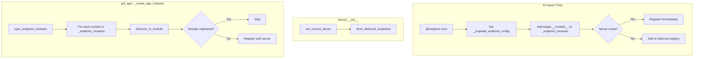

# Endpoint Registration Guide

**Version**: 0.0.5
**Date**: 2025-03-14

This guide explains how jvspatial's endpoint registration works and the recommended patterns for application entrypoints. With the auto-registration update, you can use a "set it and forget it" approach: decorate your functions and classes with `@endpoint`, import the modules, and endpoints register automatically.

---

## Recommended Entrypoint Pattern

### Minimal Application Setup

```python
# app/main.py

from jvspatial.api import Server

# Import your API modules so @endpoint decorators run and register
import app.api  # noqa: F401

server = Server(
    title="My API",
    description="API description",
    version="1.0.0",
    database={"db_type": "json", "db_path": "./jvdb"},
)

app = server.get_app()

if __name__ == "__main__":
    server.run(app_path="app.main:app", reload=True)
```

**That's it.** No `packages=` parameter, no `register_package()` calls. Import your API modules before creating the server (or ensure they're imported in your app startup flow), and endpoints register automatically.

### Why This Works

1. **Import triggers decorators** – When `import app.api` runs, Python loads each module in the package. Every `@endpoint` decorator executes at import time.
2. **Auto-registration** – When a decorator runs, it either registers immediately with the current server (if one exists) or defers. The deferred registry is flushed when `Server()` is created.
3. **Module tracker** – The decorator records each module's name in a persistent set. At app build time, `sync_endpoint_modules` walks that set and re-registers any endpoints from cached modules (handles uvicorn `--reload` double-load).
4. **No package list** – Import your API modules directly; endpoints auto-register via the module tracker.

---

## Endpoint Behavior: Set It and Forget It

### Requirements

1. **Use the decorator** – Apply `@endpoint` to your functions or Walker classes.
2. **Import the module** – Ensure the module is imported somewhere in your application's startup (e.g., `import app.api` in `main.py`, or via your package's `__init__.py`).

No other configuration is required.

### Path Conventions

- **Recommended**: Use paths **without** the `/api` prefix (e.g. `"/tracks"`, `"/auth/me"`). The router adds `APIRoutes.PREFIX` (default `/api`) at mount time.
- **Avoid**: `"/api/tracks"` — paths are normalized to strip the prefix, but using unprefixed paths keeps intent clear.
- Paths are normalized automatically: leading slash ensured, duplicate slashes collapsed, and API prefix stripped if present.

### Example: Function Endpoint

```python
# app/api/users.py

from jvspatial.api import endpoint

@endpoint("/users/{user_id}", methods=["GET"], auth=True, tags=["Users"])
async def get_user(user_id: str):
    user = await User.get(user_id)
    if not user:
        raise HTTPException(status_code=404, detail="User not found")
    return {"user": await user.export()}
```

### Example: user_id Injection for auth=True Endpoints

For protected endpoints, add `user_id: str` as a parameter; it is injected from `request.state.user.id`:

```python
@endpoint("/me", methods=["GET"], auth=True)
async def get_current_user_profile(user_id: str):
    """Returns the profile of the authenticated user."""
    return {"user_id": user_id, "message": "Your profile"}
```

### Example: Walker Endpoint

```python
# app/api/process.py

from jvspatial.api import endpoint
from jvspatial.core import Walker, Node, on_visit

@endpoint("/process", methods=["POST"])
class ProcessData(Walker):
    data: str

    @on_visit(Node)
    async def process(self, here):
        self.response["result"] = self.data.upper()
```

### Ensuring Modules Are Loaded

Your API package must import the modules that contain endpoints. For example:

```python
# app/api/__init__.py

from app.api import users
from app.api import process
# ... other endpoint modules
```

Or in `main.py`:

```python
import app.api  # app.api.__init__ imports all submodules
```

---

## Conditional Imports

For optional features (e.g., logging endpoints), import conditionally:

```python
# app/main.py

import app.api

if settings.DB_LOGGING_ENABLED:
    import jvspatial.logging.endpoints  # noqa: F401

server = Server(...)
```

---

## How Registration Works

### Registration Flow



### Scenarios

| Scenario | Behavior |
|----------|----------|
| **Modules imported before Server()** | Decorators defer; `flush_deferred_endpoints` registers everything at `Server.__init__`. |
| **Modules imported after Server()** | Decorators find server via context; register immediately. |
| **Uvicorn --reload** | First load populates `_endpoint_modules`. Second load uses cached modules; `sync_endpoint_modules` re-registers from cached modules. |

---

## Import Before Server

Import your API modules before creating the server so endpoints register automatically:

```python
import app.api

server = Server(title="My API")
```

---

## Related Documentation

- [Server API](server-api.md) – Server configuration and lifecycle
- [Decorator Reference](decorator-reference.md) – `@endpoint` parameters and options
- [Import Patterns](import-patterns.md) – Recommended import patterns
- [API Architecture](api-architecture.md) – Endpoint system architecture

---

**Last Updated**: 2025-03-14
**Version**: 0.0.5
